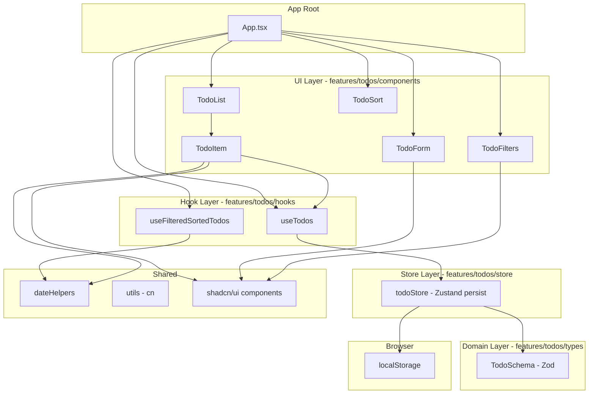
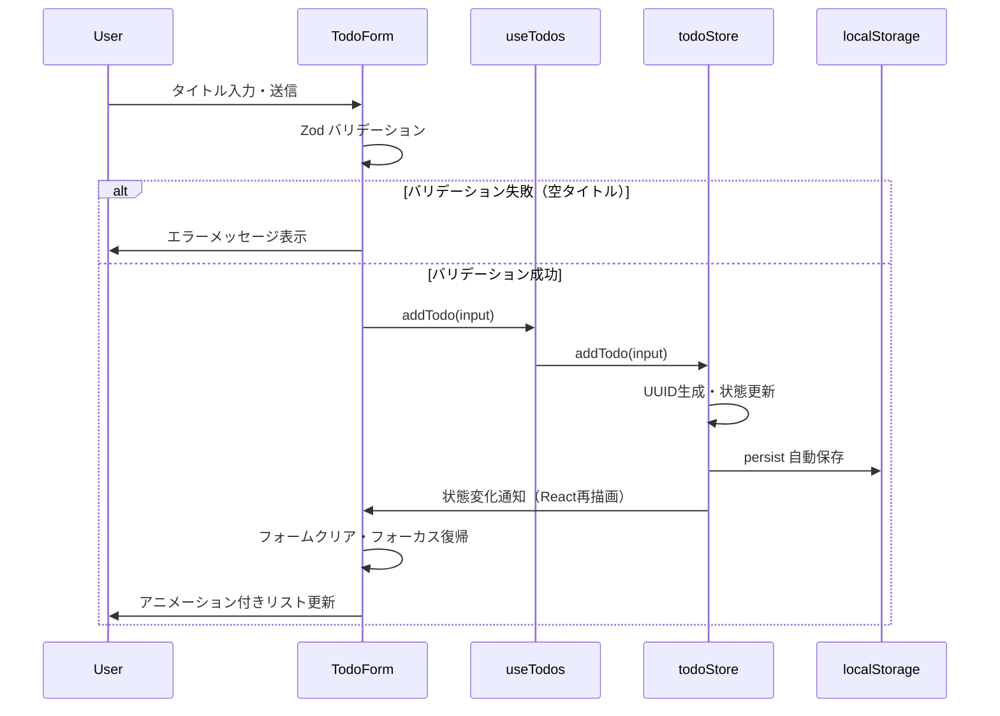
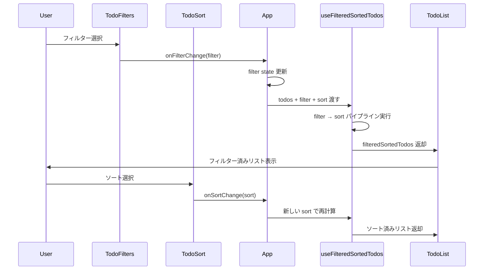

# Design Document: todo-app

## Overview

このスペックは個人向けタスク管理 SPA を届ける。ユーザーはタスクの追加・編集・完了・削除を行い、期限日・優先度の可視化と、フィルタリング・ソートによる整理ができる。データはブラウザのローカルストレージに自動保存され、セッションをまたいで永続する。

ユーザー（個人）はブラウザ上でアプリを開き、タスク一覧を確認・操作する唯一のアクター。バックエンドや認証は存在しない完全なクライアントサイドアプリである。

**Impact**: グリーンフィールド実装。既存コードベースへの影響なし。

### Goals

- タスク CRUD とデータ永続化の完全実装
- 期限切れ検知・優先度バッジによる視覚的な状態表現
- フィルター・ソート組み合わせによる柔軟なタスク整理
- Zustand persist による自動保存と復元（失敗時のフォールバック含む）
- motion v12 による滑らかな追加・削除・完了アニメーション

### Non-Goals

- ユーザー認証・マルチユーザー機能
- バックエンド API・リモートデータベース
- プッシュ通知・リマインダー
- サブタスク・階層構造
- E2E テスト

---

## Boundary Commitments

### This Spec Owns

- タスクの全 CRUD 操作とドメインロジック（Zod スキーマ、バリデーション）
- Zustand store によるインメモリ状態管理と localStorage 永続化
- フィルタリング・ソートの派生ステート計算
- 全 UI コンポーネント（Form, Item, List, Filters, Sort）
- motion アニメーション
- Vitest 単体テスト

### Out of Boundary

- バックエンド API・認証（このスペックは所有しない）
- サーバーサイドレンダリング
- 外部サービス連携（Notion 等）
- モバイルネイティブアプリ

### Allowed Dependencies

- React 19 / ReactDOM（UI ランタイム）
- Vite 6 + TypeScript 5（ビルド）
- Tailwind CSS v4 + shadcn/ui（スタイリング・UI コンポーネント）
- Zustand v5 + persist ミドルウェア（状態管理・永続化）
- Zod v3（スキーマ・バリデーション）
- motion v12（アニメーション）
- Vitest v2 + @testing-library/react v16（テスト）
- ブラウザ標準 API（localStorage, crypto.randomUUID, Date, Intl）

### Revalidation Triggers

- `Todo` 型の shape 変更（フィールド追加・削除・型変更）
- localStorage キー名の変更（既存データの互換性）
- フィルター種別・ソートフィールドの追加・削除
- Zustand store の public インターフェース変更

---

## Architecture

### Architecture Pattern & Boundary Map

Feature-based アーキテクチャを採用。`features/todos/` 配下にドメイン・状態・フック・コンポーネントを集約し、汎用ユーティリティを `shared/` に分離する。

依存方向（左から右への一方向のみ許可）：
```
Types → Store → Hooks → Components → App
                Shared (Utils) ↑ (横断的、どのレイヤーからも参照可)
```



**Key Decisions**:
- ストアは状態とアクションのみを所有。ビジネスルール（バリデーション）は Zod スキーマとフックに委譲
- `useFilteredSortedTodos` はピュア計算のみ（副作用なし）。テスト容易性を最優先
- `TodoForm` は add/edit 両モードを `mode` prop で制御し、コード重複を排除

### Technology Stack

| Layer | Choice / Version | Role |
|-------|-----------------|------|
| UI Runtime | React 19 | SPA レンダリング・状態管理 React 部分 |
| Language | TypeScript 5.x | 型安全性、Zod 型推論 |
| Build Tool | Vite 6 + @vitejs/plugin-react | バンドル・HMR |
| Styling | Tailwind CSS v4 + @tailwindcss/vite | ユーティリティ CSS（CSS-first 設定） |
| UI Components | shadcn/ui（Tailwind v4 対応版） | Button, Badge, Input, Select 等 |
| State / Persistence | Zustand v5 + persist | インメモリ状態 + localStorage 自動同期 |
| Validation | Zod v3 | スキーマ定義、バリデーション、型推論 |
| Animation | motion v12（`motion/react`） | リスト追加・削除・完了アニメーション |
| Testing | Vitest v2 + @testing-library/react v16 | 単体テスト |
| Package Manager | pnpm | 依存解決・スクリプト |

---

## File Structure Plan

### Directory Structure

```
src/
├── features/
│   └── todos/
│       ├── components/
│       │   ├── TodoForm.tsx          # add/edit 共用フォーム（mode prop で制御）
│       │   ├── TodoItem.tsx          # 1 タスクの表示・操作（完了トグル・編集・削除）
│       │   ├── TodoList.tsx          # AnimatePresence ラッパー + 空状態表示
│       │   ├── TodoFilters.tsx       # フィルタータブ（all/active/completed/overdue）
│       │   ├── TodoSort.tsx          # ソート選択（dueDate/priority/createdAt）
│       │   └── index.ts             # barrel export
│       ├── hooks/
│       │   ├── useTodos.ts           # CRUD + storageError をストアから取得するファサード
│       │   ├── useFilteredSortedTodos.ts  # filter + sort の派生ステート計算
│       │   └── index.ts
│       ├── store/
│       │   └── todoStore.ts          # Zustand store（persist ミドルウェア付き）
│       └── types/
│           └── todo.ts               # Zod スキーマ + 推論型（Todo, CreateTodoInput 等）
├── shared/
│   ├── components/
│   │   └── ui/                      # shadcn/ui 生成コンポーネント（pnpm dlx shadcn add）
│   └── lib/
│       ├── utils.ts                  # cn() tailwind クラスマージユーティリティ
│       └── dateHelpers.ts            # isOverdue(), formatDate()
├── test/
│   └── setup.ts                     # jest-dom マッチャー登録 + cleanup
├── app/
│   └── App.tsx                      # ルートコンポーネント（filter/sort state を所有）
└── main.tsx                         # エントリーポイント
index.css                            # Tailwind v4 CSS-first 設定 + shadcn デザイントークン
vite.config.ts                       # Vite 6 + tailwindcss() プラグイン
vitest.config.ts                     # Vitest 設定（jsdom, globals, setupFiles）
```

### Modified Files

なし（グリーンフィールド）。すべて新規作成。

---

## System Flows

### タスク追加フロー



### フィルター・ソートフロー



---

## Requirements Traceability

| 要件 | Summary | 主要コンポーネント | インターフェース |
|------|---------|------------------|---------------|
| 1.1, 1.3 | タスク追加・フォームリセット | TodoForm, todoStore | CreateTodoInput |
| 1.2 | 空タイトルバリデーション | TodoForm | Zod min(1) |
| 2.1–2.4 | タスク編集（表示・保存・キャンセル・バリデーション） | TodoItem, TodoForm, todoStore | UpdateTodoInput |
| 3.1–3.3 | 完了トグル・アニメーション | TodoItem, todoStore | toggleTodo |
| 4.1–4.2 | 削除・削除アニメーション | TodoItem, TodoList, todoStore | deleteTodo, AnimatePresence |
| 5.1–5.3 | 期限日設定・期限切れスタイル・日付なし処理 | TodoForm, TodoItem, dateHelpers | Todo.dueDate, isOverdue() |
| 6.1–6.3 | 優先度 UI・バッジ・デフォルト値 | TodoForm, TodoItem | Priority, PrioritySchema |
| 7.1–7.4 | 4フィルター・適用・空状態・組み合わせ | TodoFilters, useFilteredSortedTodos, TodoList | FilterType |
| 8.1–8.2 | ソート UI・適用 | TodoSort, useFilteredSortedTodos | SortField |
| 9.1–9.3 | 自動保存・復元・失敗フォールバック | todoStore（persist）, App | PersistOptions, storageError |
| 10.1–10.2 | レスポンシブ・タッチ操作 | 全コンポーネント（Tailwind responsive prefix） | — |
| 11.1–11.3 | 追加・削除・完了アニメーション | TodoList, TodoItem, motion | AnimatePresence, motion.div |
| 12.1–12.3 | CRUD・フィルター・永続化の単体テスト | todoStore, useFilteredSortedTodos | Vitest |

---

## Components and Interfaces

### Summary Table

| Component | Layer | Intent | Req Coverage | Key Dependencies |
|-----------|-------|--------|--------------|-----------------|
| `TodoSchema` | Domain | Zod スキーマ + 型推論 | 全要件 | Zod v3 |
| `todoStore` | Store | CRUD アクション + persist | 1–4, 9 | Zustand v5, TodoSchema |
| `useTodos` | Hook | ストアのファサード + storageError 公開 | 1–4, 9.3 | todoStore |
| `useFilteredSortedTodos` | Hook | filter → sort パイプライン | 7, 8 | dateHelpers |
| `TodoForm` | UI | add/edit 共用フォーム | 1, 2 | shadcn/ui, Zod |
| `TodoItem` | UI | タスク表示・完了・編集・削除 | 3–6, 11.3 | useTodos, dateHelpers, motion |
| `TodoList` | UI | AnimatePresence ラッパー + 空状態 | 4.2, 7.3, 11.1–11.2 | motion, TodoItem |
| `TodoFilters` | UI | フィルタータブ | 7.1 | shadcn/ui |
| `TodoSort` | UI | ソート選択 | 8.1 | shadcn/ui |
| `dateHelpers` | Shared | isOverdue(), formatDate() | 5.2, 8.2 | Date, Intl |
| `App` | Root | filter/sort state 管理・レイアウト | 全体統合 | 全コンポーネント・フック |

---

### Domain Layer

#### TodoSchema（`src/features/todos/types/todo.ts`）

| Field | Detail |
|-------|--------|
| Intent | Zod スキーマでドメイン型を定義し、バリデーションと型推論を一元管理する |
| Requirements | 1.1, 1.2, 2.4, 6.3 |

**Contracts**: State [ ✓ ]

```typescript
import { z } from 'zod'

export const PrioritySchema = z.enum(['high', 'medium', 'low'])
export type Priority = z.infer<typeof PrioritySchema>

export const TodoSchema = z.object({
  id: z.string().uuid(),
  title: z.string().min(1, 'タイトルは必須です'),
  completed: z.boolean(),
  priority: PrioritySchema.default('low'),
  dueDate: z.string().optional(), // YYYY-MM-DD
  createdAt: z.string().datetime(),
  updatedAt: z.string().datetime(),
})
export type Todo = z.infer<typeof TodoSchema>

export const CreateTodoInputSchema = TodoSchema.pick({
  title: true,
  priority: true,
  dueDate: true,
})
export type CreateTodoInput = z.infer<typeof CreateTodoInputSchema>

export const UpdateTodoInputSchema = CreateTodoInputSchema.partial()
export type UpdateTodoInput = z.infer<typeof UpdateTodoInputSchema>

export type FilterType = 'all' | 'active' | 'completed' | 'overdue'
export type SortField = 'dueDate' | 'priority' | 'createdAt'
```

**Implementation Notes**:
- `dueDate` は YYYY-MM-DD 文字列（`<input type="date">` の出力形式と一致）
- `createdAt` / `updatedAt` は ISO 8601 datetime 文字列。`new Date().toISOString()` で生成
- `priority` の Zod default により、未指定時は自動的に `'low'` が設定される

---

### Store Layer

#### todoStore（`src/features/todos/store/todoStore.ts`）

| Field | Detail |
|-------|--------|
| Intent | タスクの CRUD アクションと localStorage 永続化を担う Zustand ストア |
| Requirements | 1.1, 1.3, 2.2, 3.1, 3.2, 4.1, 9.1, 9.2, 9.3 |

**Responsibilities & Constraints**:
- タスクの配列状態と全ミューテーションを所有する唯一のソース
- `storageError: boolean` で永続化失敗を UI に伝える
- ID 生成（`crypto.randomUUID()`）とタイムスタンプ管理を担当
- ストア外からの直接状態変更は禁止

**Dependencies**:
- External: Zustand v5 — 状態管理（P0）
- External: TodoSchema — バリデーション（P0）
- External: localStorage — 永続化ターゲット（P1）

**Contracts**: State [ ✓ ]

##### State Management

```typescript
import { create } from 'zustand'
import { persist } from 'zustand/middleware'
import type { Todo, CreateTodoInput, UpdateTodoInput } from '../types/todo'

interface TodoState {
  todos: Todo[]
  storageError: boolean
}

interface TodoActions {
  addTodo: (input: CreateTodoInput) => void
  updateTodo: (id: string, updates: UpdateTodoInput) => void
  toggleTodo: (id: string) => void
  deleteTodo: (id: string) => void
  setStorageError: (error: boolean) => void
}

type TodoStore = TodoState & TodoActions

export const useTodoStore = create<TodoStore>()(
  persist(
    (set) => ({
      todos: [],
      storageError: false,
      addTodo: (input) =>
        set((state) => ({
          todos: [
            ...state.todos,
            {
              id: crypto.randomUUID(),
              title: input.title,
              completed: false,
              priority: input.priority ?? 'low',
              dueDate: input.dueDate,
              createdAt: new Date().toISOString(),
              updatedAt: new Date().toISOString(),
            },
          ],
        })),
      updateTodo: (id, updates) =>
        set((state) => ({
          todos: state.todos.map((t) =>
            t.id === id ? { ...t, ...updates, updatedAt: new Date().toISOString() } : t
          ),
        })),
      toggleTodo: (id) =>
        set((state) => ({
          todos: state.todos.map((t) =>
            t.id === id
              ? { ...t, completed: !t.completed, updatedAt: new Date().toISOString() }
              : t
          ),
        })),
      deleteTodo: (id) =>
        set((state) => ({ todos: state.todos.filter((t) => t.id !== id) })),
      setStorageError: (error) => set({ storageError: error }),
    }),
    {
      name: 'todo-app-storage',
      onRehydrateStorage: () => (state, error) => {
        if (error) {
          state?.setStorageError(true)
        }
      },
    }
  )
)
```

**Implementation Notes**:
- Hydration: `useTodoStore.persist.hasHydrated()` を App.tsx でチェックし、hydration 完了前はスケルトン表示
- localStorage クォータ超過エラーは `onRehydrateStorage` では捕捉されない。アクション内で `try/catch` を追加し、`QuotaExceededError` を `setStorageError(true)` にマップする
- Risks: hydration のタイミングで SSR 環境（将来対応）では問題が発生する可能性。現在はクライアントのみなので許容

---

### Hook Layer

#### useTodos（`src/features/todos/hooks/useTodos.ts`）

| Field | Detail |
|-------|--------|
| Intent | todoStore の CRUD アクションと storageError を UI レイヤーに公開するファサードフック |
| Requirements | 1.1, 1.3, 2.2, 3.1, 3.2, 4.1, 9.3 |

**Contracts**: Service [ ✓ ]

##### Service Interface

```typescript
interface UseTodosReturn {
  todos: Todo[]
  storageError: boolean
  addTodo: (input: CreateTodoInput) => void
  updateTodo: (id: string, updates: UpdateTodoInput) => void
  toggleTodo: (id: string) => void
  deleteTodo: (id: string) => void
}

export function useTodos(): UseTodosReturn
```

- Preconditions: todoStore が初期化済みであること（Zustand により保証）
- Postconditions: ミューテーション後、todos 配列が即時更新される
- Invariants: todos 配列の各要素は TodoSchema を満たす

---

#### useFilteredSortedTodos（`src/features/todos/hooks/useFilteredSortedTodos.ts`）

| Field | Detail |
|-------|--------|
| Intent | todos 配列にフィルター・ソートを適用して派生リストを返すピュアなフック |
| Requirements | 7.1, 7.2, 7.3, 7.4, 8.1, 8.2 |

**Contracts**: Service [ ✓ ]

##### Service Interface

```typescript
export function useFilteredSortedTodos(
  todos: Todo[],
  filter: FilterType,
  sort: SortField
): Todo[]
```

内部ロジック：
1. **Filter パイプライン**:
   - `'all'`: 全タスク
   - `'active'`: `!completed`
   - `'completed'`: `completed === true`
   - `'overdue'`: `!completed && isOverdue(dueDate)`
2. **Sort パイプライン**（filter 後に適用）:
   - `'dueDate'`: 期限日昇順（未設定は末尾）
   - `'priority'`: high > medium > low
   - `'createdAt'`: 作成日降順（新しい順）

- Preconditions: `todos` は `Todo[]` 型の配列
- Postconditions: 返却配列は元の `todos` への参照を持たない（コピー）
- Invariants: フィルターと ソートを同時適用。フィルターが先、ソートが後

**Implementation Notes**:
- `useMemo` でメモ化し、`todos`, `filter`, `sort` が変化した場合のみ再計算
- 副作用なし（ピュア計算）

---

### UI Layer

#### TodoForm（`src/features/todos/components/TodoForm.tsx`）

| Field | Detail |
|-------|--------|
| Intent | タスクの追加・編集を行う共用フォームコンポーネント |
| Requirements | 1.1, 1.2, 1.3, 2.1, 2.3, 2.4, 6.1 |

**Contracts**: State [ ✓ ]

```typescript
type TodoFormMode = 'add' | 'edit'

interface TodoFormProps {
  mode: TodoFormMode
  initialTodo?: Todo          // edit モード時に渡す
  onSubmit: (input: CreateTodoInput | UpdateTodoInput) => void
  onCancel?: () => void       // edit モード時のみ有効
}
```

フォームフィールド:
- `title`: テキスト入力（必須、min 1）
- `dueDate`: date 入力（オプション）
- `priority`: Select（high / medium / low）

バリデーション: `CreateTodoInputSchema.safeParse()` を送信時に実行。失敗時はフィールドレベルでエラーメッセージを表示。

**Implementation Notes**:
- React 制御コンポーネント（`useState` でフォーム状態管理）
- add モード: 送信成功後にフィールドをリセットしてフォーカスを title 入力に戻す（要件 1.3）
- edit モード: `initialTodo` の値で初期化。キャンセル時は `onCancel` を呼び出す（要件 2.3）

---

#### TodoItem（`src/features/todos/components/TodoItem.tsx`）

| Field | Detail |
|-------|--------|
| Intent | 1 タスクの表示・完了トグル・編集・削除を担うコンポーネント |
| Requirements | 2.1, 2.2, 2.3, 2.4, 3.1, 3.2, 3.3, 4.1, 5.1, 5.2, 5.3, 6.2, 6.3 |

```typescript
interface TodoItemProps {
  todo: Todo
  onToggle: (id: string) => void
  onUpdate: (id: string, updates: UpdateTodoInput) => void
  onDelete: (id: string) => void
}
```

表示要素:
- タイトル（完了時: 取り消し線）
- 優先度バッジ（high: 赤, medium: 黄, low: 緑）
- 期限日表示（`formatDate(dueDate)`）
- 期限切れ表示（`isOverdue(dueDate)` が true の場合、赤色テキスト + アイコン）
- 完了チェックボックス
- 編集・削除ボタン

内部状態: `isEditing: boolean`（true の場合 TodoForm を edit モードでレンダリング）

**Implementation Notes**:
- 完了アニメーション（要件 3.3）: `motion.div` で opacity と scale のトランジション
- 未設定 `dueDate` は表示なし（要件 5.3）

---

#### TodoList（`src/features/todos/components/TodoList.tsx`）

**Summary**: `AnimatePresence` で `TodoItem` の追加・削除アニメーションを制御するラッパーコンポーネント。`todos` が空の場合、フィルターに合致するタスクがない旨のメッセージを表示する（要件 7.3）。

Req Coverage: 4.2, 7.3, 11.1, 11.2

```typescript
interface TodoListProps {
  todos: Todo[]
  currentFilter: FilterType
  onToggle: (id: string) => void
  onUpdate: (id: string, updates: UpdateTodoInput) => void
  onDelete: (id: string) => void
}
```

#### TodoFilters（`src/features/todos/components/TodoFilters.tsx`）

**Summary**: all / active / completed / overdue の 4 フィルタータブを表示するコンポーネント（要件 7.1）。

Req Coverage: 7.1

```typescript
interface TodoFiltersProps {
  currentFilter: FilterType
  onFilterChange: (filter: FilterType) => void
}
```

#### TodoSort（`src/features/todos/components/TodoSort.tsx`）

**Summary**: dueDate / priority / createdAt の 3 ソート基準を選択する Select コンポーネント（要件 8.1）。

Req Coverage: 8.1

```typescript
interface TodoSortProps {
  currentSort: SortField
  onSortChange: (sort: SortField) => void
}
```

---

### Shared Layer

#### dateHelpers（`src/shared/lib/dateHelpers.ts`）

| Field | Detail |
|-------|--------|
| Intent | 日付比較・フォーマットのピュア関数。外部ライブラリ不使用 |
| Requirements | 5.2, 8.2 |

```typescript
export function isOverdue(dueDate: string | undefined): boolean
// undefined または今日以降の日付は false を返す

export function formatDate(dueDate: string | undefined): string
// undefined → '' / 有効日付 → 'yyyy/MM/dd' 形式（Intl.DateTimeFormat 使用）

export function compareDates(a: string | undefined, b: string | undefined): number
// undefined は末尾扱いで昇順比較

export const PRIORITY_ORDER: Record<Priority, number> = {
  high: 0,
  medium: 1,
  low: 2,
}
```

**Implementation Notes**:
- `isOverdue`: 今日の 00:00:00 と比較（時間を除いた日付比較）
- タイムゾーン: ブラウザのローカルタイムゾーンを使用

---

## Data Models

### Domain Model

```
Todo (Aggregate Root)
├── id: UUID (identity)
├── title: string (1文字以上)
├── completed: boolean
├── priority: 'high' | 'medium' | 'low' (default: 'low')
├── dueDate?: string (YYYY-MM-DD, optional)
├── createdAt: datetime (ISO 8601)
└── updatedAt: datetime (ISO 8601)

Business Rules:
- title は空であってはならない
- priority のデフォルトは 'low'
- dueDate が未設定のタスクは期限切れにはならない
- 完了済みタスク（completed: true）は期限切れフィルターに含まれない
- 同一タスクの同時編集は発生しない（シングルユーザー）
```

### Physical Data Model（localStorage）

**ストレージキー**: `todo-app-storage`

```json
{
  "state": {
    "todos": [
      {
        "id": "uuid-v4",
        "title": "string",
        "completed": false,
        "priority": "low",
        "dueDate": "2026-06-01",
        "createdAt": "2026-05-19T00:00:00.000Z",
        "updatedAt": "2026-05-19T00:00:00.000Z"
      }
    ],
    "storageError": false
  },
  "version": 0
}
```

**Consistency**: Zustand persist が各アクション後に自動的に JSON.stringify してストアに保存。

---

## Error Handling

### Error Strategy

ユーザー入力エラー（バリデーション）はフィールドレベルで即時フィードバック。インフラエラー（localStorage）はアプリ上部のバナーで通知し、セッション内動作は継続する。

### Error Categories and Responses

| エラー種別 | 発生条件 | 対応 |
|-----------|---------|------|
| 空タイトル（バリデーション） | フォーム送信時に title が空 | フォーカスを title に移動し「タイトルは必須です」メッセージ表示 |
| localStorage 読み込み失敗 | プライベートブラウジング、権限なし | `storageError: true` をセット → App.tsx がバナー表示。動作は継続（インメモリのみ） |
| localStorage 書き込み失敗 | クォータ超過（QuotaExceededError） | addTodo / updateTodo / deleteTodo の try/catch で `setStorageError(true)` を呼び出し |

### Monitoring

本アプリはクライアントのみのため、エラーモニタリングは `console.error` ログに留める（外部サービス不使用）。

---

## Testing Strategy

### Unit Tests（Vitest + @testing-library/react）

**Store テスト**（`src/features/todos/store/todoStore.test.ts`）— 要件 12.1
- `addTodo`: 正常追加・空タイトル Zod バリデーション・デフォルト priority
- `updateTodo`: フィールド更新・`updatedAt` 更新確認
- `toggleTodo`: completed フラグの切替
- `deleteTodo`: 対象 ID のみ削除

**フック テスト**（`src/features/todos/hooks/useFilteredSortedTodos.test.ts`）— 要件 12.2
- FilterType 別の絞り込み結果（all / active / completed / overdue）
- SortField 別のソート順（dueDate 昇順・priority 降順・createdAt 降順）
- フィルター + ソート組み合わせ
- 空配列インプット時の安全性

**永続化テスト**（`src/features/todos/store/todoStore.persist.test.ts`）— 要件 12.3
- `localStorage` モック（`vi.stubGlobal`）でデータ保存確認
- ストア再初期化後のデータ復元確認
- `localStorage` エラー時の `storageError: true` セット確認

**コンポーネント テスト**（補助、要件 12.1 の一部）
- `TodoForm`: 送信・バリデーションエラー表示・キャンセル
- `TodoItem`: チェックボックス・編集モード切替・削除

### Testing Constraints

- motion v12 アニメーションをテストする場合は `vi.useFakeTimers()` と `act()` を使用
- `crypto.randomUUID()` は `vi.stubGlobal('crypto', { randomUUID: () => 'test-uuid' })` でスタブ

---

## Security Considerations

- localStorage はオリジン分離のため XSS 耐性は通常のブラウザセキュリティに委ねる
- ユーザー入力は Zod スキーマで検証済みのデータのみストアに保存
- 外部 API・認証なし。CSRF・インジェクションリスクは対象外

## Performance & Scalability

- `useFilteredSortedTodos` は `useMemo` でメモ化。数百タスクまでは問題なし
- localStorage の上限は通常 5MB。タスクデータ（文字列中心）であれば数万件まで余裕
- アニメーション: motion v12 の GPU アクセラレーション活用（`transform` / `opacity` のみ変更）
